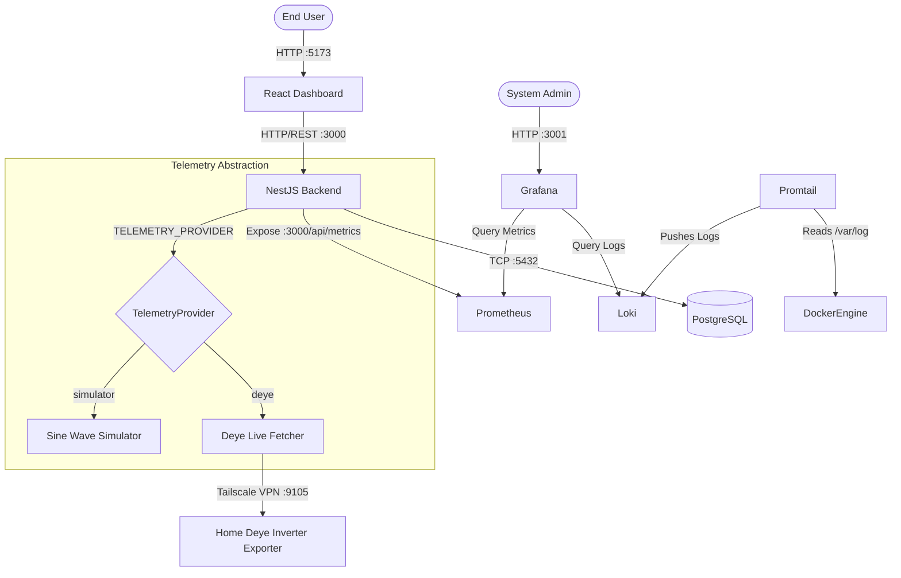
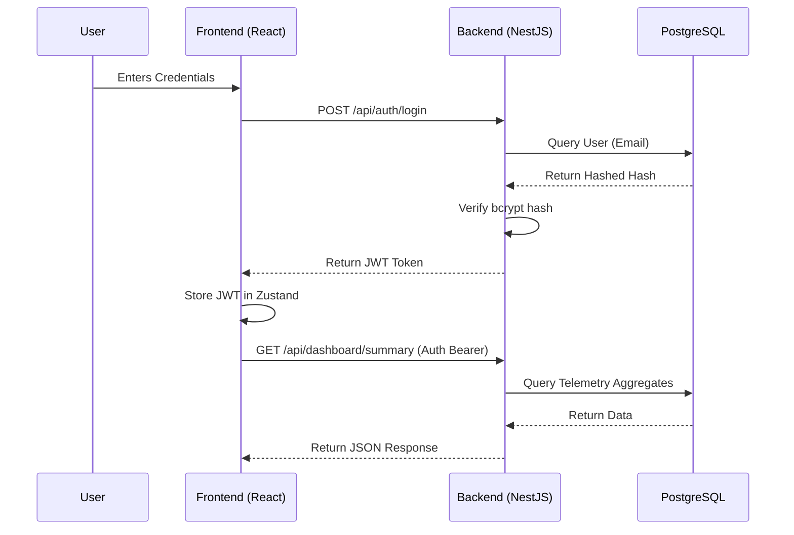
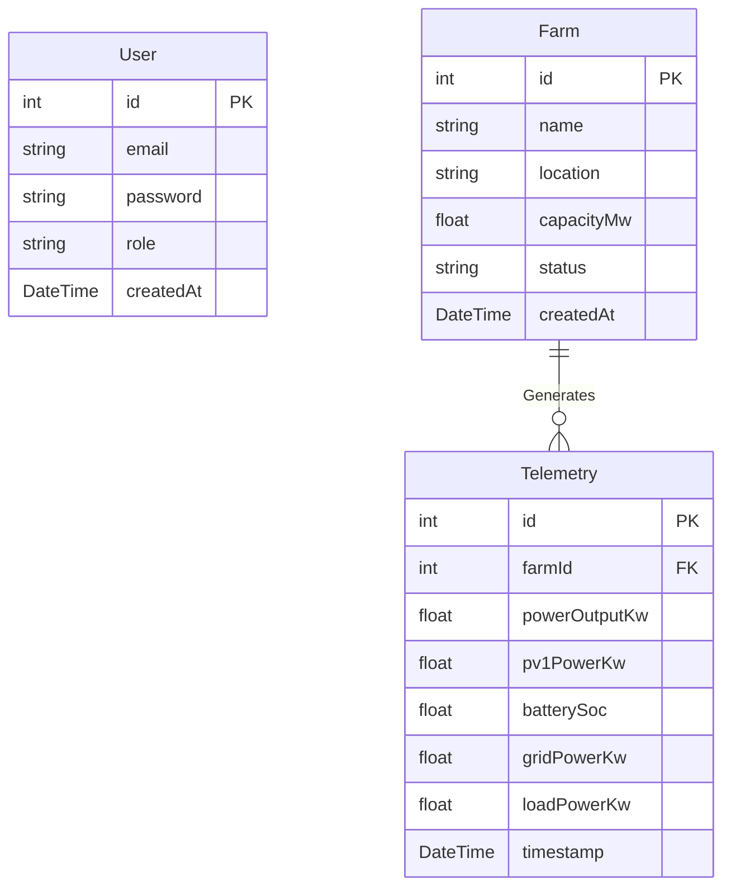

# System Architecture

Helios Control Center is built using a modern, decoupled microservices-oriented architecture orchestrated by Docker Compose. This document details the structural components and the architectural decisions driving the project.

## 1. Overall System Architecture

The ecosystem relies on a strict separation of concerns, heavily utilizing RESTful HTTP boundaries and centralized database storage.

## 2. Request Flow (Authentication)

This sequence demonstrates how the frontend securely retrieves protected telemetry using JWT authentication.

## 3. Database ER Diagram

The relational structure focuses on Solar Farms and their continuous stream of generated Telemetry.

## 4. Key Architectural Decisions

### Why NestJS for the Backend?
NestJS enforces a highly structured, Angular-like modular architecture. By using Dependency Injection and strict TypeScript decorators, it ensures the codebase remains maintainable, testable, and scalable as business logic complexities (like the `TelemetryGeneratorService`) grow.

### Why Prisma ORM over TypeORM?
Prisma provides strict type safety directly tied to the database schema. Rather than manually defining entity classes that can drift from the database structure, Prisma generates a customized TypeScript client, ensuring query safety at compile-time.

### Why React & Tailwind v4?
React provides a predictable, component-driven UI. Tailwind CSS v4 eliminates the need for bulky configuration files and provides an incredibly rapid styling developer experience. Using `shadcn/ui` leverages Radix UI's accessibility primitives, resulting in an enterprise-grade interface without massive custom CSS overhead.

### Why Docker Compose?
For this university project and initial client deliverables, Docker Compose provides a deterministic, infrastructure-as-code environment. Every developer and evaluator can reproduce the exact production environment with a single command (`make up`), eliminating "it works on my machine" inconsistencies.

### Why Prometheus + Grafana + Loki?
Instead of relying on basic `console.log`, implementing a full observability stack demonstrates an understanding of production infrastructure. Prometheus handles quantitative metrics (time-series polling), while Loki handles qualitative metrics (error logs), combining cleanly into unified Grafana dashboards.
